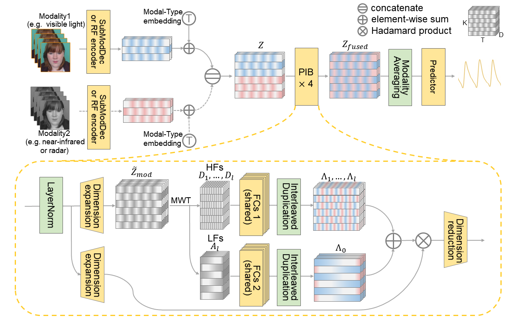

## FusionPhys

    

## Dataset Preprocessing
The original videos are firstly preprocessed to crop the face. Facial landmarks are generated using [OpenFace](https://github.com/TadasBaltrusaitis/OpenFace).
## How to use (MMSE-HR Example)
```
python train_mmsehr.py with fold_id=#fold result_dir="your exp path" dataset_source="MMSE-HR path"
python eval_mmsehr.py with fold_id=#fold result_dir="your exp path" dataset_source="MMSE-HR path"
```
## Citation
```
@inproceedings{ying2025fusionphys,
  title={FusionPhys: A Flexible Framework for Fusing Complementary Sensing Modalities in Remote Physiological Measurement},
  author={Chenhang Ying, Huiyu Yang, Jieyi Ge, Zhaodong Sun, Xu Cheng, Kui Ren and Xiaobai Li },
  booktitle={International Conference on Computer Vision (ICCV)},
  year={2025},
}
```
